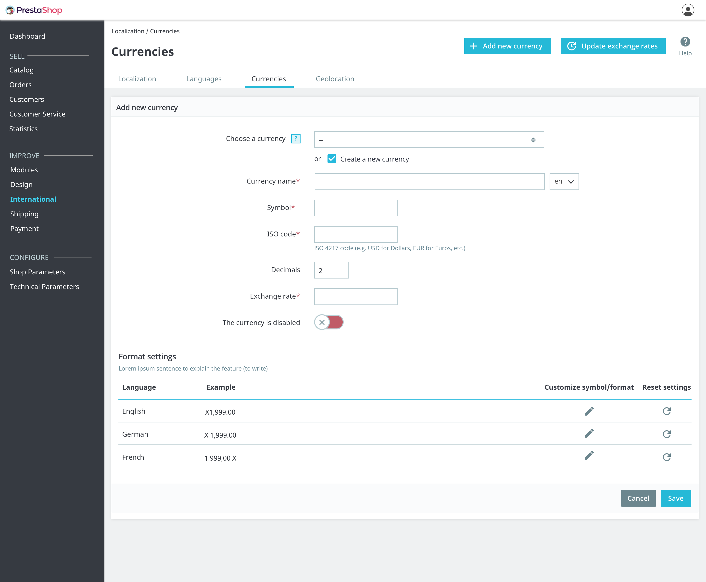

**Version aimed 1.7.6**

Localization > Currencies > Edit/Add Page

**USER STORY**

As a merchant on the Currencies Page in Localization, I want to add a new official currency or a custom one not provided by Prestashop. 

**WHY**

The 1.6 had a custom currency creation but was limited to the international needs. Therefore on the 1.7, it was removed to prepare the development of a bigger feature more complete. 

The Unicode CLDR (Common Locale Data Repository) is a database containing the convention of different languages as format date, currencies and more shared by the biggest companies. It will be the main source to provide the best currencies pre-configuration to the merchant. 

This features allows the merchant to have all the currency (cryptocurrencies, local currencies...) that he needs and responds to every customers expectations.
The merchant just has to find right paiement module adapted to their new currency.

**SPECIFICATION**

The 1rst improvements features of the Page Add Currency and Edit Currency in Page Currencies of Localization Category allow:

 - Add an official new currency with the CLDR or create a custom
   currency. 
 - Edit a currency (this is new in 1.7)

Add/Edit currency inputs:

- Currency name * (mandatory)
- Symbol *  (mandatory)
- ISO code *  (mandatory)
- Decimals
- Exchange rate (1.00 by default)

The Symbol, Currency name, ISO code and Exchange rate are mandatory to save an official currency or a custom one.

**OLD SPECIFICATION** 

- #10058
- #11690

**DETAILED SPECIFICATION**

**Add a currency**

The user can choose from a drop list from our currency database (CDLR) or select the checkbox “Create new” to make a custom currency.

      
Choosing a currency from the drop list will fill all the inputs automatically and make the ISO code uneditable.

If the user edits the currency chosen in the drop list just before saving , the currency will be marked as “Edited” on the Currencies Page.

And by checking “Create new”, the user has to fill all the inputs by himself and choose an new unique ISO code.

A warning should be display, if the user choose to create his own custom currency and choose an ISO code already existing. The ISO code is an unique value used as the identification of the currency.

Warning wording: “This ISO code already exists. You cannot create two states with the same ISO code.” in Admin/International/Notification”

Ajouter un commentaire en dessous de ISO qu’il s’agit d’une valeure unique

**Edit a currency** 

After clicking on editing one of the currency in the list, the Edit Page is open with all the inputs already filled from the currency selected.

All the following fields can be edited:

- Currency name 
- Currency Symbol 
- ISO code (only for custom currencies)
- Decimals (2 by default)
- Exchange rate (1 by default)

Bellow these fields, a reset button is available to put back the initial content of all the fields. The button is hidden for custom currency.

**Currencies Page**

On the Currencies Page, every edited currency will be mark as “edited” next to their name on the currencies list.

NB: after the migration, the activation exchange rate is on the bottom of the list.

**DESIGN**

https://projects.invisionapp.com/d/main#/console/16335086/338742836/preview

**CASES**

Error/Warning case: 

Saving with an ISO code already existing in the database

Exchange rate update for the custom currencies, check if it doesn't apply a default value

**ISSUES RELATED**

 - [ ] #9714
 - [ ] #10014
 - [ ] #10017
 - [ ] #10055
 - [ ] #10054
 - [ ] #10053
 - [ ] #9885

**ACCEPTANCE CRITERIA**

To be completed with QA and developers.

Given... [a context],

when... [users does something],

then... [what the user should observe]

